# Οδηγός χρήσης του περιβάλλοντος διαχείρισης

Κάθε οθόνη της εφαρμογής, με εικόνα και εξήγηση: τι δείχνει, τι μπορεί να κάνει ο χρήστης, και ποιοι κανόνες ισχύουν από πίσω. Περιλαμβάνονται και οι λειτουργίες που είναι διαθέσιμες μόνο στον λογαριασμό διαχειριστή.

> Για έκδοση PDF, ανοίξτε το `odigos-admin.html` και επιλέξτε Εκτύπωση → Αποθήκευση ως PDF.

## Περιεχόμενα

1. [Σύνδεση](#1-σύνδεση) — Η πρώτη οθόνη. Κανένα άλλο τμήμα της εφαρμογής δεν είναι προσβάσιμο χωρίς σύνδεση.
2. [Λειτουργίες — Σύνοψη](#2-λειτουργίες-σύνοψη) — Η αρχική οθόνη μετά τη σύνδεση. Δείχνει πόσα Vacuum βρίσκονται σε κάθε κατάσταση αυτή τη στιγμή.
3. [Λειτουργίες — Αναλυτική λίστα](#3-λειτουργίες-αναλυτική-λίστα) — Το παράθυρο που ανοίγει από το «Προβολή λίστας» δείχνει ποια ακριβώς Vacuum βρίσκονται στην κατηγορία.
4. [Λειτουργίες — Οι τέσσερις ροές εργασίας](#4-λειτουργίες-οι-τέσσερις-ροές-εργασίας) — Οι ίδιες ενέργειες που κάνει ο χειριστής από το κινητό, διαθέσιμες και από τον υπολογιστή με πληκτρολόγηση αντί για σάρωση QR.
5. [Κινήσεις — Ιστορικό](#5-κινήσεις-ιστορικό) — Το πλήρες ιστορικό κάθε μετακίνησης, με φίλτρα και εξαγωγή. Εδώ απαντάται το «πού ήταν αυτό το Vacuum τον προηγούμενο μήνα».
6. [Κινήσεις — Φωτογραφίες βλάβης](#6-κινήσεις-φωτογραφίες-βλάβης) — Οι φωτογραφίες που τράβηξε ο χειριστής, ομαδοποιημένες σε δήλωση βλάβης και αποκατάσταση.
7. [Καταχώρηση — Βασικά δεδομένα](#7-καταχώρηση-βασικά-δεδομένα) — Εδώ ορίζεται το «τι υπάρχει»: τα Vacuum, τα μηχανήματα, οι θέσεις ραφιών και ο κατάλογος βλαβών.
8. [Καταχώρηση — Μηχανήματα, θέσεις και βλάβες](#8-καταχώρηση-μηχανήματα-θέσεις-και-βλάβες) — Οι υπόλοιπες τρεις υποκαρτέλες ακολουθούν την ίδια λογική με τα Vacuum.
9. [Αναφορές](#9-αναφορές) — Πέντε έτοιμες αναλύσεις πάνω στα ίδια δεδομένα, με γραφήματα και εξαγωγή.
10. [Αναφορές — Θέση Vacuum](#10-αναφορές-θέση-vacuum) — Η τρέχουσα εικόνα: πού βρίσκεται κάθε Vacuum αυτή τη στιγμή και σε ποια κατάσταση.
11. [Ρυθμίσεις — Μόνο για διαχειριστές](#11-ρυθμίσεις-μόνο-για-διαχειριστές) — Το εικονίδιο του γραναζιού εμφανίζεται μόνο στους χρήστες με ρόλο Διαχειριστή.
12. [Διαχείριση χρηστών](#12-διαχείριση-χρηστών) — Η ενότητα Χρήστες μέσα στις ρυθμίσεις: δημιουργία λογαριασμών, κωδικοί και απενεργοποίηση.
13. [Δημιουργία χρήστη](#13-δημιουργία-χρήστη) — Τέσσερα πεδία. Ο κωδικός ορίζεται εδώ και ανακοινώνεται στον χρήστη.
14. [Ορισμός κωδικού από τον διαχειριστή](#14-ορισμός-κωδικού-από-τον-διαχειριστή) — Για την περίπτωση που ένας χρήστης ξέχασε τον κωδικό του.
15. [Αλλαγή του δικού σας κωδικού](#15-αλλαγή-του-δικού-σας-κωδικού) — Κάθε χρήστης με πρόσβαση στις ρυθμίσεις μπορεί να αλλάξει τον κωδικό του.

---

## 1. Σύνδεση

Η πρώτη οθόνη. Κανένα άλλο τμήμα της εφαρμογής δεν είναι προσβάσιμο χωρίς σύνδεση.

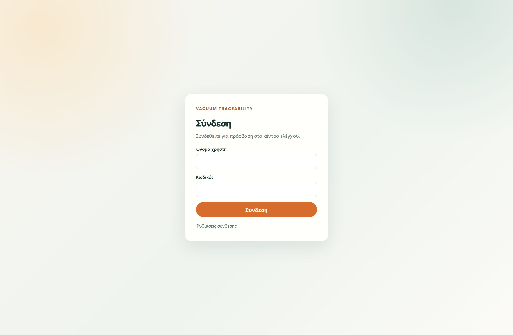

Κάθε χρήστης έχει προσωπικό λογαριασμό· δεν υπάρχει κοινός κωδικός. Η συνεδρία κρατά 12 ώρες και αποθηκεύεται στον συγκεκριμένο φυλλομετρητή, οπότε σε κοινόχρηστο υπολογιστή χρειάζεται αποσύνδεση στο τέλος της βάρδιας.
Το **Ρυθμίσεις σύνδεσης** εμφανίζει τη διεύθυνση του διακομιστή. Ορίζεται μία φορά ανά υπολογιστή και διατηρείται· ένας χειριστής που συνδέεται αργότερα στο ίδιο μηχάνημα τη βρίσκει έτοιμη.

| Στοιχείο | Τι κάνει |
|---|---|
| **Όνομα χρήστη** | Πάντα με πεζά γράμματα. |
| **Κωδικός** | Τουλάχιστον 10 χαρακτήρες, με γράμματα και αριθμούς. |
| **Ρυθμίσεις σύνδεσης** | Αλλαγή της διεύθυνσης του διακομιστή, αν η εφαρμογή δεν τον βρίσκει. |

> Μετά από πέντε αποτυχημένες προσπάθειες μέσα σε ένα λεπτό, η σύνδεση μπλοκάρεται προσωρινά. Το μήνυμα λάθους είναι σκόπιμα το ίδιο για λάθος όνομα και για λάθος κωδικό, ώστε να μην μπορεί κανείς να ανιχνεύσει ποια ονόματα χρηστών υπάρχουν.

---

## 2. Λειτουργίες — Σύνοψη

Η αρχική οθόνη μετά τη σύνδεση. Δείχνει πόσα Vacuum βρίσκονται σε κάθε κατάσταση αυτή τη στιγμή.

Οι τρεις αριθμοί ενημερώνονται **ζωντανά**: όταν κάποιος χειριστής κάνει χρέωση από το κινητό, ο αριθμός αλλάζει εδώ χωρίς ανανέωση σελίδας. Η ένδειξη «Live σύνδεση ενεργή» επιβεβαιώνει ότι η ζωντανή σύνδεση λειτουργεί· αν πέσει, εμφανίζεται κουμπί χειροκίνητης ανανέωσης.

| Στοιχείο | Τι κάνει |
|---|---|
| **Ενεργά Vacuum** | Βρίσκονται πάνω σε μηχάνημα και χρησιμοποιούνται. |
| **Ανενεργά Vacuum** | Βρίσκονται σε θέση ραφιού, διαθέσιμα. |
| **Προς επισκευή** | Έχουν δηλωμένη βλάβη και βρίσκονται σε θέση επισκευής. |
| **Προβολή λίστας** | Ανοίγει αναλυτικό παράθυρο με τα Vacuum της κατηγορίας. |

---

## 3. Λειτουργίες — Αναλυτική λίστα

Το παράθυρο που ανοίγει από το «Προβολή λίστας» δείχνει ποια ακριβώς Vacuum βρίσκονται στην κατηγορία.

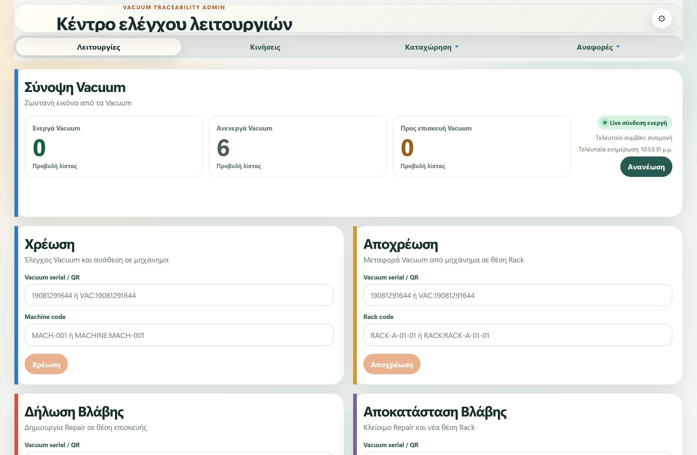

Χρησιμεύει για τη γρήγορη απάντηση σε ερωτήματα του τύπου «ποια Vacuum είναι διαθέσιμα τώρα;» ή «τι ακριβώς περιμένει επισκευή;». Κάθε γραμμή δείχνει τον σειριακό αριθμό, την τρέχουσα θέση ή μηχάνημα, και τη σχετική χρονική σήμανση.

---

## 4. Λειτουργίες — Οι τέσσερις ροές εργασίας

Οι ίδιες ενέργειες που κάνει ο χειριστής από το κινητό, διαθέσιμες και από τον υπολογιστή με πληκτρολόγηση αντί για σάρωση QR.

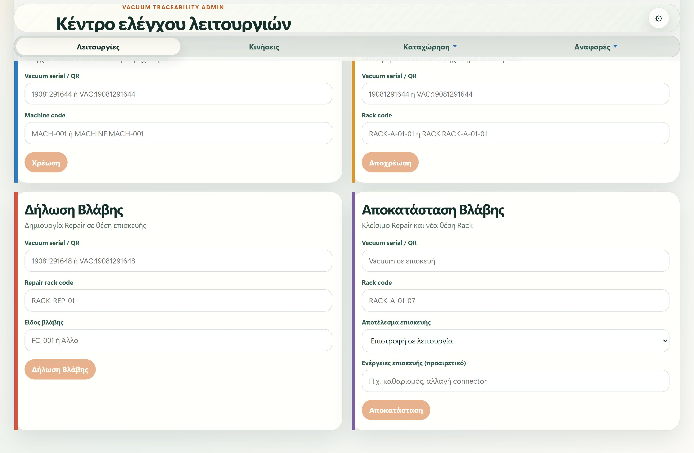

Χρησιμοποιούνται όταν λείπει η συσκευή, όταν το QR δεν διαβάζεται, ή για διορθωτικές κινήσεις από το γραφείο. Οι κανόνες είναι **ακριβώς οι ίδιοι** με το κινητό: ο διακομιστής ελέγχει κάθε κίνηση και απορρίπτει ό,τι δεν επιτρέπεται — για παράδειγμα χρέωση Vacuum που βρίσκεται ήδη σε άλλο μηχάνημα.
Τα πεδία διαθέτουν αναζήτηση με υποδείξεις: πληκτρολογώντας μέρος του κωδικού εμφανίζονται οι διαθέσιμες επιλογές από τη βάση, ώστε να μη χρειάζεται να τους θυμάται κανείς.

| Στοιχείο | Τι κάνει |
|---|---|
| **Χρέωση** | Ανάθεση ενός Vacuum σε μηχάνημα. Χρειάζεται σειριακό αριθμό και κωδικό μηχανήματος. |
| **Αποχρέωση** | Επιστροφή από το μηχάνημα σε θέση ραφιού. |
| **Δήλωση Βλάβης** | Μεταφορά σε θέση επισκευής, με επιλογή είδους βλάβης από τον κατάλογο. |
| **Αποκατάσταση Βλάβης** | Κλείσιμο της επισκευής, με αποτέλεσμα (επιστροφή σε λειτουργία, εκτός λειτουργίας, απόσυρση, ή παραμονή σε επισκευή) και νέα θέση. |

---

## 5. Κινήσεις — Ιστορικό

Το πλήρες ιστορικό κάθε μετακίνησης, με φίλτρα και εξαγωγή. Εδώ απαντάται το «πού ήταν αυτό το Vacuum τον προηγούμενο μήνα».

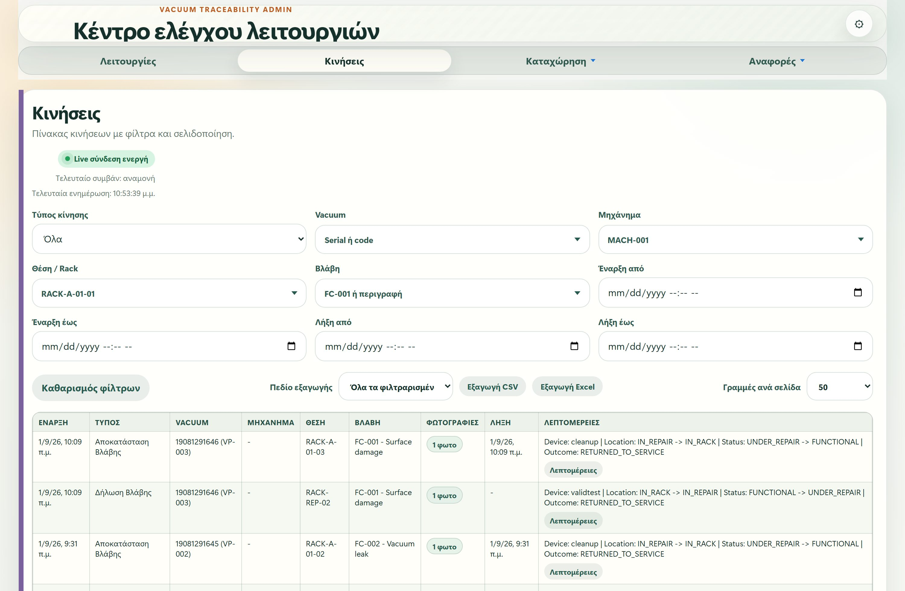

Κάθε γραμμή είναι μία κίνηση: πότε έγινε, τι είδους ήταν, ποιο Vacuum αφορά, από ποια θέση σε ποια, ποια βλάβη, και πόσες φωτογραφίες συνοδεύουν. Η στήλη **Λεπτομέρειες** δείχνει τη μετάβαση κατάστασης και τη συσκευή από την οποία έγινε η καταχώρηση.
Τα φίλτρα συνδυάζονται μεταξύ τους. Μέσα σε ένα πεδίο οι επιλογές λειτουργούν διαζευκτικά (Vacuum Α *ή* Β), ενώ διαφορετικά πεδία περιορίζουν αθροιστικά (Vacuum Α *και* μηχάνημα Χ).

| Στοιχείο | Τι κάνει |
|---|---|
| **Φίλτρα** | Τύπος κίνησης, Vacuum, μηχάνημα, θέση, βλάβη, και εύρος ημερομηνιών έναρξης/λήξης. |
| **Εξαγωγή CSV** | Για Excel, με ελληνική κωδικοποίηση και ερωτηματικό ως διαχωριστικό. |
| **Εξαγωγή Excel** | Απευθείας αρχείο υπολογιστικού φύλλου. |
| **Πεδίο εξαγωγής** | Επιλογή ανάμεσα στην τρέχουσα σελίδα ή σε όλες τις φιλτραρισμένες γραμμές. |
| **Γραμμές ανά σελίδα** | 25, 50, 100 ή 200. |
| **Λεπτομέρειες** | Ανοίγει παράθυρο με πλήρη τεχνικά στοιχεία της κίνησης. |

---

## 6. Κινήσεις — Φωτογραφίες βλάβης

Οι φωτογραφίες που τράβηξε ο χειριστής, ομαδοποιημένες σε δήλωση βλάβης και αποκατάσταση.

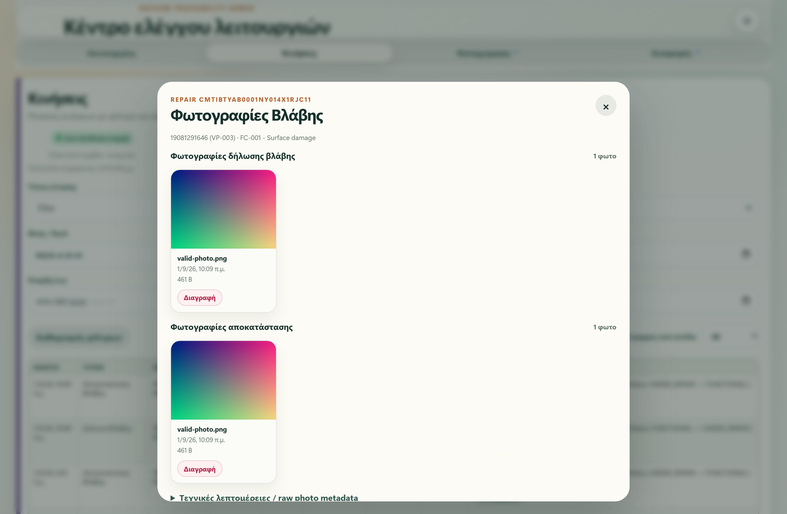

Ανοίγει από την ένδειξη φωτογραφιών στη γραμμή της κίνησης. Αποτελεί την οπτική τεκμηρίωση της βλάβης: τι εντοπίστηκε κατά τη δήλωση και σε τι κατάσταση παραδόθηκε μετά την αποκατάσταση.
Οι εικόνες **δεν** βρίσκονται σε δημόσια διαδρομή. Ζητούνται από τον διακομιστή, ο οποίος τις διοχετεύει στον φυλλομετρητή αφού επιβεβαιώσει ότι ο χρήστης είναι συνδεδεμένος.

| Στοιχείο | Τι κάνει |
|---|---|
| **Κλικ στη φωτογραφία** | Άνοιγμα σε πλήρες μέγεθος, σε νέα καρτέλα. |
| **Διαγραφή** | Οριστική αφαίρεση μιας λανθασμένης ή δοκιμαστικής φωτογραφίας. Διαγράφεται πρώτα το αρχείο και έπειτα η εγγραφή. |

---

## 7. Καταχώρηση — Βασικά δεδομένα

Εδώ ορίζεται το «τι υπάρχει»: τα Vacuum, τα μηχανήματα, οι θέσεις ραφιών και ο κατάλογος βλαβών.

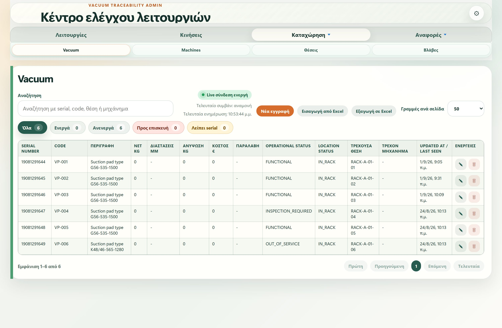

Τέσσερις υποκαρτέλες, μία για κάθε είδος. Οι κωδικοί παράγονται αυτόματα από τον διακομιστή (`VP-###` για Vacuum, `MACH-###` για μηχανήματα, `FC-###` για βλάβες), ώστε να μην υπάρχουν διπλοεγγραφές.
Για τα Vacuum, το κρίσιμο πεδίο είναι ο **σειριακός αριθμός**: χωρίς αυτόν η εγγραφή θεωρείται ελλιπής, σημειώνεται ως εκτός λειτουργίας και δεν εμφανίζεται στις ροές χρέωσης μέχρι να συμπληρωθεί.

| Στοιχείο | Τι κάνει |
|---|---|
| **Νέα εγγραφή** | Δημιουργία, με «Αποθήκευση και νέα εγγραφή» για συνεχόμενες καταχωρήσεις. |
| **Επεξεργασία** | Αλλαγή στοιχείων υπάρχουσας εγγραφής. |
| **Απόσυρση** | Ασφαλής απενεργοποίηση αντί για διαγραφή, ώστε να μη χαθεί το ιστορικό. Vacuum που βρίσκεται σε μηχάνημα πρέπει πρώτα να αποχρεωθεί. |
| **Εισαγωγή από Excel** | Μαζική καταχώρηση, με προεπισκόπηση των αλλαγών πριν την οριστικοποίηση. |
| **Εξαγωγή σε Excel** | Όλες οι εγγραφές, σε μορφή που ξαναδιαβάζεται από την εισαγωγή. |

> Η εισαγωγή από Excel δεν διαγράφει ποτέ ιστορικά δεδομένα, κινήσεις ή επισκευές. Δείχνει πρώτα τι θα δημιουργηθεί, τι θα ενημερωθεί και τι θα μείνει ως έχει, και εκτελείται μόνο μετά από επιβεβαίωση.

---

## 8. Καταχώρηση — Μηχανήματα, θέσεις και βλάβες

Οι υπόλοιπες τρεις υποκαρτέλες ακολουθούν την ίδια λογική με τα Vacuum.

**Μηχανήματα**: ο εξοπλισμός στον οποίο τοποθετούνται τα Vacuum. **Θέσεις**: οι θέσεις ραφιών, με ξεχωριστό τύπο για τις θέσεις επισκευής. **Βλάβες**: ο κατάλογος από τον οποίο επιλέγει ο χειριστής κατά τη δήλωση, ώστε οι αναφορές να ομαδοποιούν σωστά.
Ο κωδικός μιας θέσης παράγεται από την περιοχή, τη σειρά και τη θέση της, οπότε αντιστοιχεί σε φυσικό σημείο της αποθήκης.

---

## 9. Αναφορές

Πέντε έτοιμες αναλύσεις πάνω στα ίδια δεδομένα, με γραφήματα και εξαγωγή.

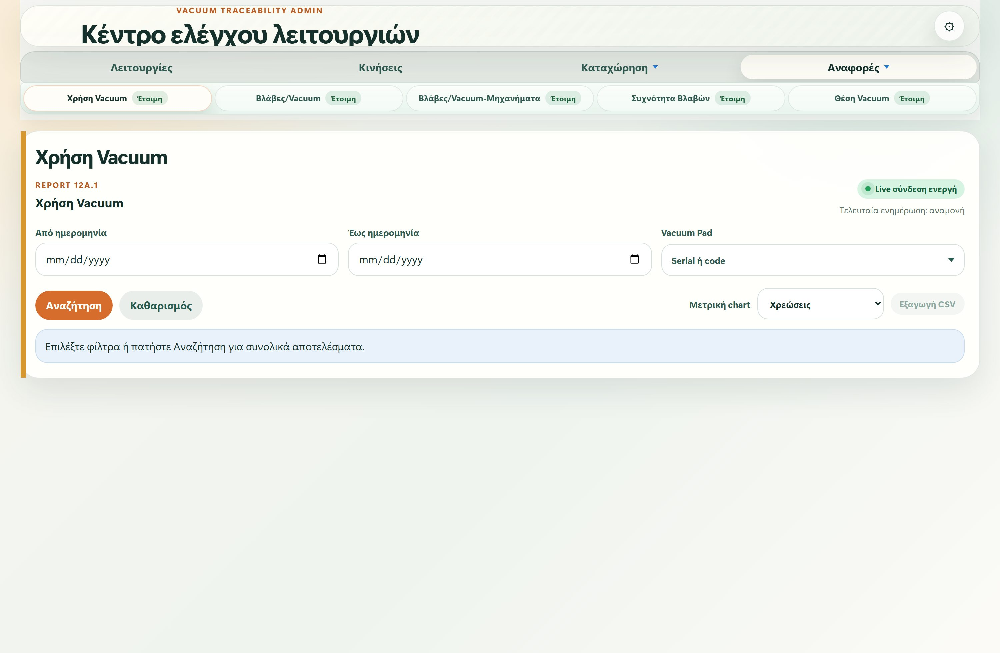

Κάθε αναφορά δέχεται τα ίδια φίλτρα με τις Κινήσεις, ώστε να απαντά σε συγκεκριμένο ερώτημα και όχι μόνο σε γενική εικόνα.

| Στοιχείο | Τι κάνει |
|---|---|
| **Χρήση Vacuum** | Ποια χρησιμοποιούνται περισσότερο: πλήθος χρεώσεων, ώρες χρήσης, νεκρός χρόνος, μέση παραμονή σε μηχάνημα. |
| **Βλάβες/Vacuum** | Ποια παρουσιάζουν τις περισσότερες βλάβες, με είδη βλαβών και ώρες επισκευής. |
| **Βλάβες/Vacuum-Μηχανήματα** | Ποια μηχανήματα συνδέονται με τις περισσότερες βλάβες. |
| **Συχνότητα Βλαβών** | Ποιοι τύποι βλάβης εμφανίζονται συχνότερα, με ανάλυση 80/20. |
| **Θέση Vacuum** | Πού βρίσκεται αυτή τη στιγμή κάθε Vacuum. |

> Η αναφορά «Βλάβες/Vacuum-Μηχανήματα» βασίζεται σε εκτίμηση: επειδή η βλάβη δεν καταγράφει ρητά μηχάνημα, αποδίδεται στο μηχάνημα της τελευταίας χρέωσης πριν τη δήλωση. Οι περιπτώσεις χωρίς προηγούμενη χρέωση μετρώνται ξεχωριστά ως μη αποδοθείσες, αντί να μαντεύονται. Η ίδια η αναφορά το αναγράφει.

---

## 10. Αναφορές — Θέση Vacuum

Η τρέχουσα εικόνα: πού βρίσκεται κάθε Vacuum αυτή τη στιγμή και σε ποια κατάσταση.

Η πιο άμεσα χρήσιμη αναφορά για την καθημερινή λειτουργία. Κατηγοριοποιεί κάθε Vacuum ως ενεργό σε μηχάνημα, διαθέσιμο σε ράφι, σε επισκευή, ή με άγνωστη θέση.
Τα δύο φίλτρα ελέγχου — *μόνο όσα λείπει ο σειριακός* και *μόνο άγνωστη θέση* — εντοπίζουν τις εγγραφές που χρειάζονται τακτοποίηση. Χρήσιμα κατά την αρχική καταχώρηση, όταν συμπληρώνονται σταδιακά τα στοιχεία.

---

## 11. Ρυθμίσεις — Μόνο για διαχειριστές

Το εικονίδιο του γραναζιού εμφανίζεται μόνο στους χρήστες με ρόλο Διαχειριστή.

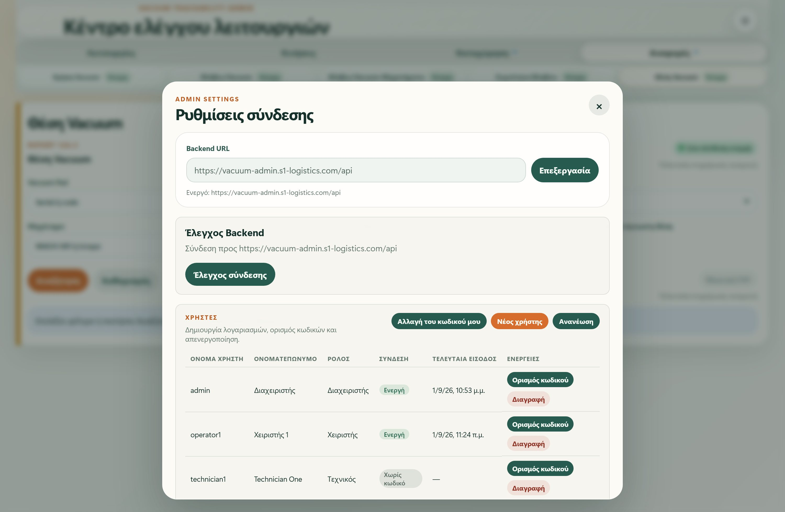

Οι υπόλοιποι ρόλοι βλέπουν στη θέση του ένα κουμπί **Αποσύνδεση**: μπορούν να τερματίσουν τη συνεδρία τους, αλλά δεν έχουν πρόσβαση σε ρυθμίσεις ή λογαριασμούς.
Ο περιορισμός δεν είναι απλή απόκρυψη στην οθόνη. Ο διακομιστής απορρίπτει με σφάλμα κάθε αίτημα διαχείρισης χρηστών που δεν προέρχεται από Διαχειριστή, ακόμη κι αν κάποιος το στείλει παρακάμπτοντας το περιβάλλον.

| Στοιχείο | Τι κάνει |
|---|---|
| **Backend URL** | Η διεύθυνση του διακομιστή. Αποθηκεύεται στον φυλλομετρητή και ισχύει και για όσους συνδεθούν μετά στο ίδιο μηχάνημα. |
| **Έλεγχος σύνδεσης** | Επιβεβαιώνει ότι ο διακομιστής και η βάση απαντούν. |

---

## 12. Διαχείριση χρηστών

Η ενότητα Χρήστες μέσα στις ρυθμίσεις: δημιουργία λογαριασμών, κωδικοί και απενεργοποίηση.

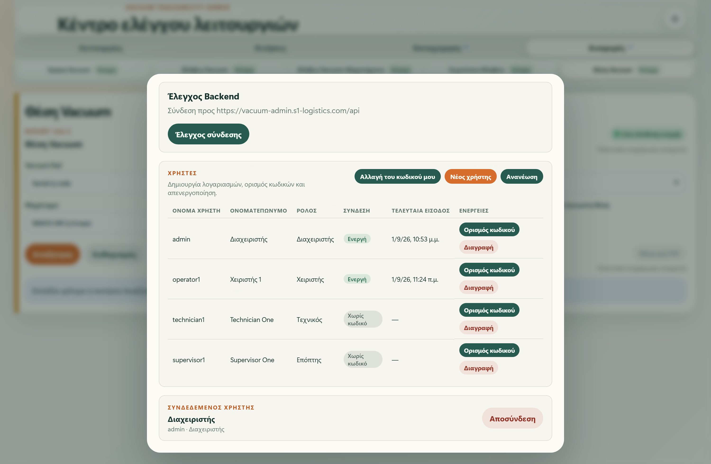

Ο πίνακας δείχνει για κάθε λογαριασμό τον ρόλο, αν μπορεί να συνδεθεί, και πότε συνδέθηκε τελευταία φορά. Οι λογαριασμοί με ένδειξη **Χωρίς κωδικό** υπάρχουν μόνο για να αποδίδονται σε αυτούς παλιές κινήσεις και δεν μπορούν να συνδεθούν μέχρι να τους οριστεί κωδικός.
Στο κάτω μέρος εμφανίζεται ο συνδεδεμένος χρήστης και το κουμπί αποσύνδεσης.

| Στοιχείο | Τι κάνει |
|---|---|
| **Νέος χρήστης** | Δημιουργία λογαριασμού με ρόλο και αρχικό κωδικό. |
| **Ορισμός κωδικού** | Ορισμός νέου κωδικού σε χρήστη που τον ξέχασε. |
| **Αλλαγή του κωδικού μου** | Αλλαγή του δικού σας κωδικού, με επιβεβαίωση του τρέχοντος. |
| **Διαγραφή** | Απενεργοποίηση λογαριασμού. |
| **Ανανέωση** | Επαναφόρτωση της λίστας. |

> Η διαγραφή απενεργοποιεί τον λογαριασμό και σβήνει τον κωδικό του, αλλά διατηρεί την εγγραφή: κινήσεις, επισκευές και το μητρώο ελέγχου παραπέμπουν σε αυτήν και η οριστική διαγραφή θα κατέστρεφε το ιστορικό. Δύο διαγραφές απορρίπτονται — ο δικός σας λογαριασμός και ο τελευταίος εναπομείνας Διαχειριστής.

---

## 13. Δημιουργία χρήστη

Τέσσερα πεδία. Ο κωδικός ορίζεται εδώ και ανακοινώνεται στον χρήστη.

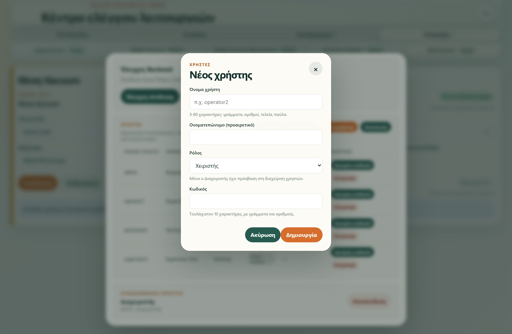

Το όνομα χρήστη μετατρέπεται πάντα σε πεζά και δέχεται γράμματα, αριθμούς, τελεία, παύλα και κάτω παύλα. Το ονοματεπώνυμο είναι προαιρετικό αλλά βοηθά, γιατί εμφανίζεται στους πίνακες αντί για το όνομα χρήστη.
Ο ρόλος καθορίζει τα δικαιώματα. Για το προσωπικό καθημερινής χρήσης επιλέγεται **Χειριστής**· ο ρόλος **Διαχειριστής** δίνει και πρόσβαση στη διαχείριση λογαριασμών και συνιστάται να δοθεί σε ένα ή δύο άτομα.

| Στοιχείο | Τι κάνει |
|---|---|
| **Όνομα χρήστη** | 3-60 χαρακτήρες. Πρέπει να είναι μοναδικό. |
| **Ονοματεπώνυμο** | Προαιρετικό. Εμφανίζεται αντί για το όνομα χρήστη. |
| **Ρόλος** | Διαχειριστής, Επόπτης, Τεχνικός ή Χειριστής. |
| **Κωδικός** | Τουλάχιστον 10 χαρακτήρες, με γράμματα και αριθμούς. |

---

## 14. Ορισμός κωδικού από τον διαχειριστή

Για την περίπτωση που ένας χρήστης ξέχασε τον κωδικό του.

Ο διαχειριστής ορίζει απευθείας νέο κωδικό, χωρίς να χρειάζεται να γνωρίζει τον παλιό. Ο χρήστης ενημερώνεται και μπορεί στη συνέχεια να τον αλλάξει μόνος του.
Οι κωδικοί δεν αποθηκεύονται ποτέ σε αναγνώσιμη μορφή και δεν επιστρέφονται από τον διακομιστή — ούτε στον διαχειριστή. Ένας ξεχασμένος κωδικός δεν ανακτάται· αντικαθίσταται.

---

## 15. Αλλαγή του δικού σας κωδικού

Κάθε χρήστης με πρόσβαση στις ρυθμίσεις μπορεί να αλλάξει τον κωδικό του.

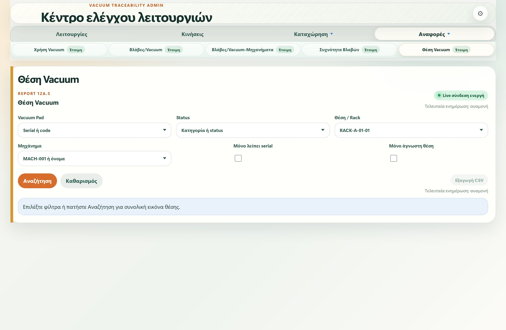

Απαιτείται ο τρέχων κωδικός, ώστε να μην μπορεί κάποιος να αλλάξει τα διαπιστευτήρια σε ξεχασμένη ανοιχτή συνεδρία. Ο νέος κωδικός ζητείται δύο φορές και πρέπει να διαφέρει από τον προηγούμενο.

> Συνιστάται η αλλαγή του αρχικού κωδικού του διαχειριστή αμέσως μετά την εγκατάσταση, εφόσον δημιουργήθηκε από άλλο άτομο ή κοινοποιήθηκε γραπτώς.

---

Οι εικόνες προέρχονται από ζωντανή εγκατάσταση με δοκιμαστικά δεδομένα. Οι λειτουργίες που σημειώνονται ως διαθέσιμες μόνο σε διαχειριστές επιβάλλονται από τον διακομιστή, όχι μόνο από την εμφάνιση της οθόνης.
