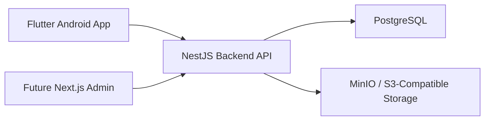

# Architecture

## High-Level Architecture

The system will use a mobile-first operational flow with a backend-centered domain model.

Core intent:

- Flutter handles scanning and operator workflows
- NestJS owns business rules and state transitions
- PostgreSQL stores the operational source-of-truth data
- MinIO stores repair photos in local development
- A future Next.js admin app will use the same backend API

## Why the Backend Is the Source of Truth

The backend must be the source of truth because traceability rules are operationally critical and must remain consistent across all clients.

This means:

- Current pad location must be computed and persisted centrally
- Charge and decharge validation must happen server-side
- Repair lifecycle enforcement must happen server-side
- Audit log creation must happen server-side
- Flutter may show UI hints, but it must not own the real business rules

## Why PostgreSQL Is Used

PostgreSQL is a strong fit because the system needs:

- Reliable transactional updates
- Relational modeling for pads, movements, repairs, machines, and racks
- Query power for dashboards and KPIs
- Good Prisma support

Charge/decharge and repair flows are stateful, so transactional consistency matters more than schema flexibility.

## Why MinIO / S3-Compatible Storage Is Used

Repair photos are binary assets and should not live directly in the relational database as large blobs for the main MVP design.

Using MinIO locally and S3-compatible storage in production gives:

- A consistent object-storage model across environments
- Easier migration from local development to production
- Clear separation between metadata in PostgreSQL and files in object storage

## Why Local Node.js Is Allowed for Development

Local Node.js on Windows is allowed because it makes day-to-day backend development faster and simpler for the team:

- Shorter edit-run-debug loop
- Native IDE and terminal workflow on Windows
- No requirement to place source code inside WSL file systems

This is a development convenience only. It does not change the production deployment model.

## Why Production Still Uses Docker

Production must stay containerized so the backend runs in a predictable and portable environment.

That gives:

- Reproducible runtime behavior
- Easier deployment packaging
- Environment consistency across servers
- Cleaner dependency management for backend services

The backend therefore needs to support both:

1. Local development using host Node.js on Windows
2. Containerized execution later through `backend/Dockerfile` and `docker-compose.yml`

## Component Interaction

### Flutter Android App

- Scans QR codes
- Shows pad details
- Initiates charge, decharge, and repair actions
- Reads current traceability state from the backend

### NestJS Backend

- Exposes APIs for traceability workflows
- Validates all business rules
- Persists source-of-truth records
- Records movement history and audit logs
- Coordinates photo metadata with object storage

### PostgreSQL

- Stores pads, machines, racks, movements, repairs, users, statuses, and audit logs
- Supports transactional state updates and reporting queries

### MinIO / S3-Compatible Storage

- Stores repair photo files
- Returns object references for backend metadata records

### Future Next.js Admin

- Uses the same backend APIs
- Focuses on dashboards, reporting, and master data management

## Local vs Production Model

### Local Development

- Backend process runs on host Node.js
- PostgreSQL and MinIO run in Docker Desktop later
- Source code stays in Windows folders

### Production

- Backend runs inside a Docker container
- Storage remains S3-compatible
- Database remains PostgreSQL

This keeps the team productive locally without sacrificing deployment consistency later.
