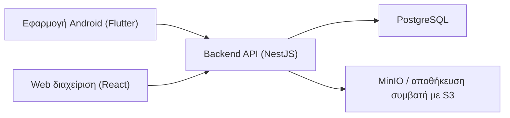

# Αρχιτεκτονική

## Συνολική εικόνα

Το σύστημα σχεδιάστηκε με τις καθημερινές εργασίες να ξεκινούν από το κινητό και όλους τους επιχειρησιακούς κανόνες να επιβάλλονται κεντρικά, στον διακομιστή.

Ο ρόλος κάθε μέρους:

- Η **εφαρμογή Android** αναλαμβάνει τη σάρωση QR και τις ροές εργασίας του χειριστή.
- Το **backend** κατέχει τους επιχειρησιακούς κανόνες και τις αλλαγές κατάστασης.
- Η **PostgreSQL** αποθηκεύει τα επιχειρησιακά δεδομένα που αποτελούν την πηγή αλήθειας.
- Το **MinIO** αποθηκεύει τις φωτογραφίες επισκευών.
- Η **web διαχείριση** χρησιμοποιεί ακριβώς το ίδιο API με το κινητό.

## Γιατί το backend είναι η πηγή αλήθειας

Οι κανόνες ιχνηλασιμότητας είναι κρίσιμοι για τη λειτουργία και πρέπει να ισχύουν με τον ίδιο ακριβώς τρόπο, ανεξάρτητα από το ποιο πρόγραμμα τους καλεί. Αν κάθε εφαρμογή κρατούσε τη δική της εκδοχή, αργά ή γρήγορα θα διαφωνούσαν μεταξύ τους.

Πρακτικά αυτό σημαίνει ότι στον διακομιστή γίνονται:

- ο υπολογισμός και η αποθήκευση της τρέχουσας θέσης κάθε vacuum,
- ο έλεγχος εγκυρότητας κάθε χρέωσης και αποχρέωσης,
- η επιβολή του κύκλου ζωής μιας επισκευής,
- η καταγραφή στο μητρώο ελέγχου (audit log).

Η εφαρμογή του κινητού μπορεί να δείχνει προειδοποιήσεις και ενδείξεις στην οθόνη, αλλά **δεν** αποφασίζει η ίδια τίποτα από τα παραπάνω.

## Γιατί PostgreSQL

Η PostgreSQL ταιριάζει επειδή το σύστημα χρειάζεται:

- αξιόπιστες ενημερώσεις με συναλλαγές (transactions),
- σχεσιακό μοντέλο για vacuum, κινήσεις, επισκευές, μηχανήματα και θέσεις,
- ικανότητα σύνθετων ερωτημάτων για τους πίνακες ελέγχου και τις αναφορές.

Οι ροές χρέωσης/αποχρέωσης και επισκευών εξαρτώνται από την τρέχουσα κατάσταση, οπότε η συνέπεια των συναλλαγών μετράει περισσότερο από την ευελιξία του σχήματος.

## Γιατί MinIO / αποθήκευση συμβατή με S3

Οι φωτογραφίες είναι δυαδικά αρχεία και δεν πρέπει να αποθηκεύονται ως μεγάλα blobs μέσα στη σχεσιακή βάση.

Η χρήση MinIO — ή οποιασδήποτε αποθήκευσης συμβατής με S3 — δίνει:

- ένα ενιαίο μοντέλο αποθήκευσης αρχείων σε όλα τα περιβάλλοντα,
- εύκολη μετάβαση από τοπική εγκατάσταση σε άλλον πάροχο, χωρίς αλλαγή κώδικα,
- καθαρό διαχωρισμό: τα **στοιχεία** της φωτογραφίας στην PostgreSQL, το **αρχείο** στην αποθήκευση αντικειμένων.

Η βάση κρατά μόνο αναφορά στο αρχείο (όνομα, μέγεθος, ποιος το ανέβασε), ποτέ την ίδια την εικόνα.

## Γιατί η παραγωγή τρέχει σε Docker

Η εγκατάσταση παραμένει σε containers ώστε το σύστημα να συμπεριφέρεται προβλέψιμα και να μεταφέρεται εύκολα:

- ίδια συμπεριφορά σε κάθε διακομιστή,
- απλή συσκευασία για εγκατάσταση και αναβάθμιση,
- καθαρή διαχείριση εξαρτήσεων.

## Τι κάνει κάθε μέρος

### Εφαρμογή Android

- Σαρώνει κωδικούς QR.
- Εμφανίζει τα στοιχεία κάθε vacuum.
- Ξεκινά χρέωση, αποχρέωση και ενέργειες επισκευής.
- Διαβάζει την τρέχουσα κατάσταση από το backend.

### Backend (NestJS)

- Εκθέτει τα API για όλες τις ροές ιχνηλασιμότητας.
- Ελέγχει κάθε επιχειρησιακό κανόνα.
- Αποθηκεύει τις εγγραφές που αποτελούν την πηγή αλήθειας.
- Καταγράφει ιστορικό κινήσεων και μητρώο ελέγχου.
- Συντονίζει τα στοιχεία των φωτογραφιών με την αποθήκευση αρχείων.
- Επιβάλλει την ταυτοποίηση χρηστών σε κάθε αίτημα.

### PostgreSQL

- Αποθηκεύει vacuum, μηχανήματα, θέσεις, κινήσεις, επισκευές, χρήστες, καταστάσεις και μητρώο ελέγχου.
- Υποστηρίζει ενημερώσεις με συναλλαγές και ερωτήματα για αναφορές.

### MinIO / αποθήκευση συμβατή με S3

- Αποθηκεύει τα αρχεία των φωτογραφιών επισκευής.
- Παραμένει **ιδιωτική**: δεν έχει δημόσια διαδρομή και ο φυλλομετρητής δεν επικοινωνεί ποτέ απευθείας μαζί της. Οι εικόνες περνούν από το backend.

### Web διαχείριση (React)

- Χρησιμοποιεί τα ίδια API με το κινητό.
- Επικεντρώνεται σε πίνακες ελέγχου, αναφορές και διαχείριση βασικών δεδομένων.
- Παρέχει τη διαχείριση λογαριασμών χρηστών, διαθέσιμη μόνο στον ρόλο διαχειριστή.

## Τοπική ανάπτυξη έναντι παραγωγής

### Ανάπτυξη

Κατά την ανάπτυξη το backend μπορεί να τρέχει απευθείας με Node.js στον υπολογιστή του προγραμματιστή, με την PostgreSQL και το MinIO σε Docker. Αυτό συντομεύει τον κύκλο δοκιμών και δεν επηρεάζει σε τίποτα τον τρόπο εγκατάστασης στην παραγωγή.

### Παραγωγή

Όλα τα μέρη τρέχουν σε containers μέσω `docker-compose.prod.yml`. Η PostgreSQL και το MinIO δεν εκθέτουν καμία θύρα προς τα έξω· backend και διαχείριση δένονται στο `127.0.0.1` ώστε ένας reverse proxy της εταιρίας να αναλαμβάνει το HTTPS και να εκθέτει μόνο τις εγκεκριμένες διαδρομές.
