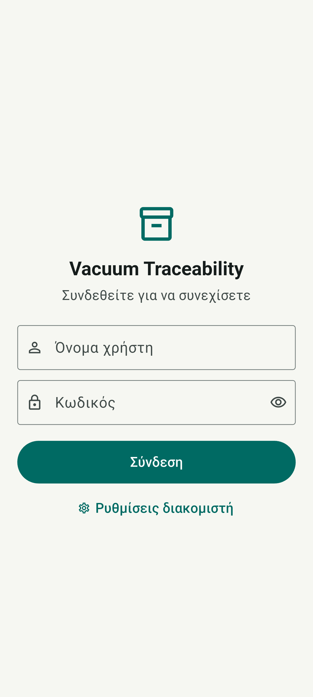
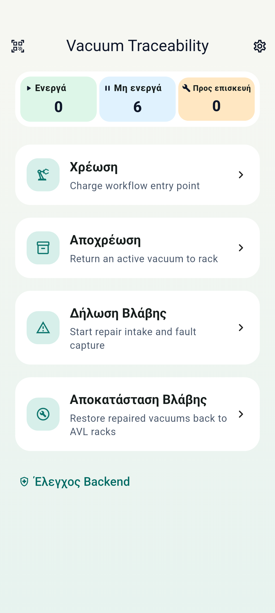
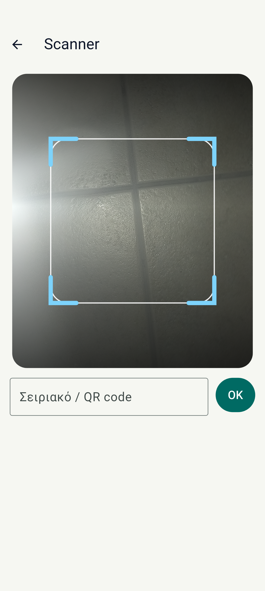
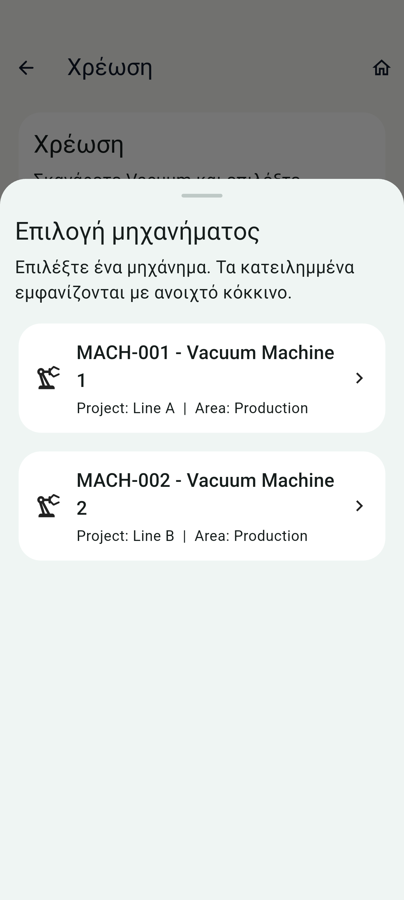
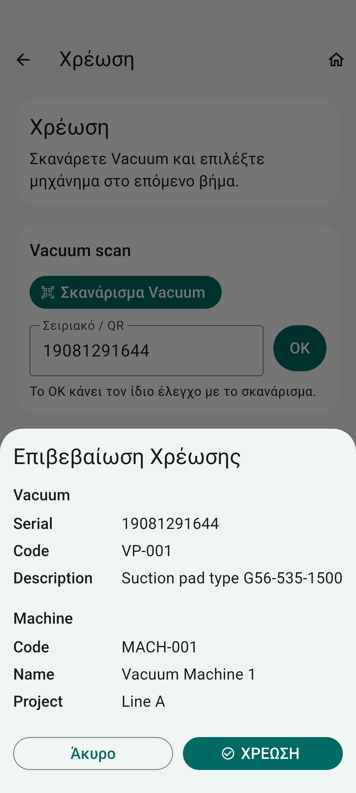
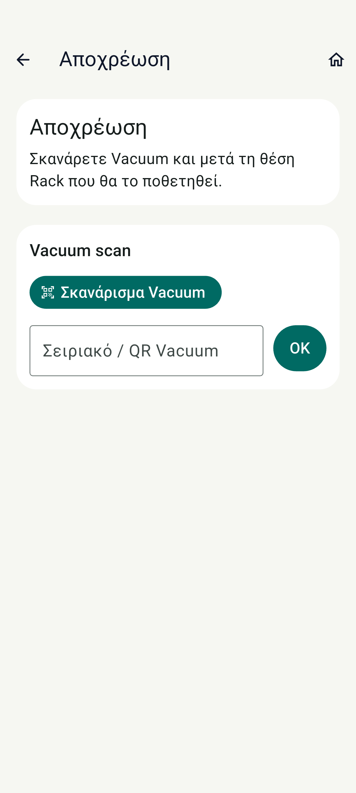
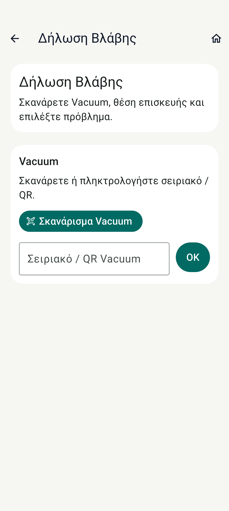
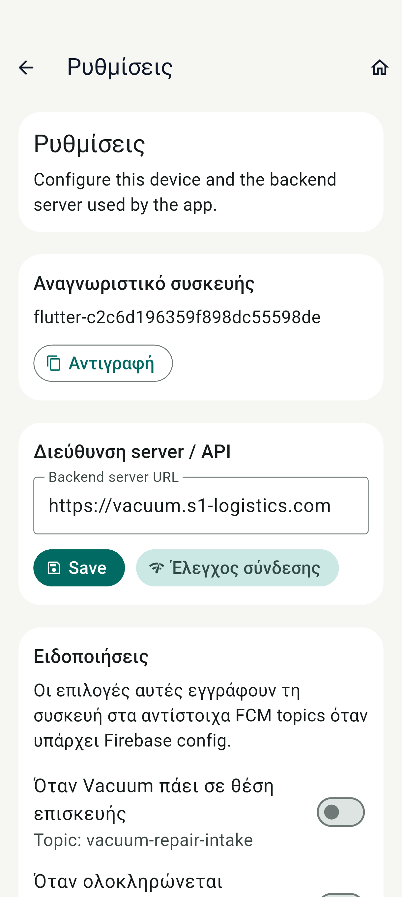
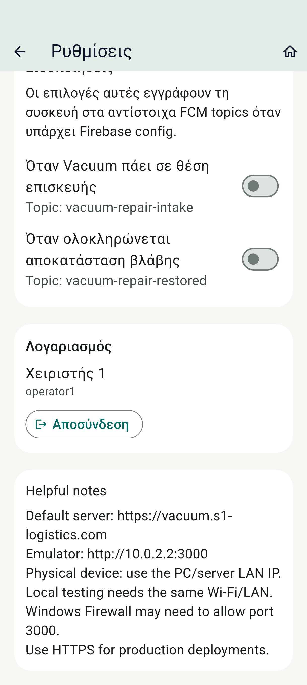
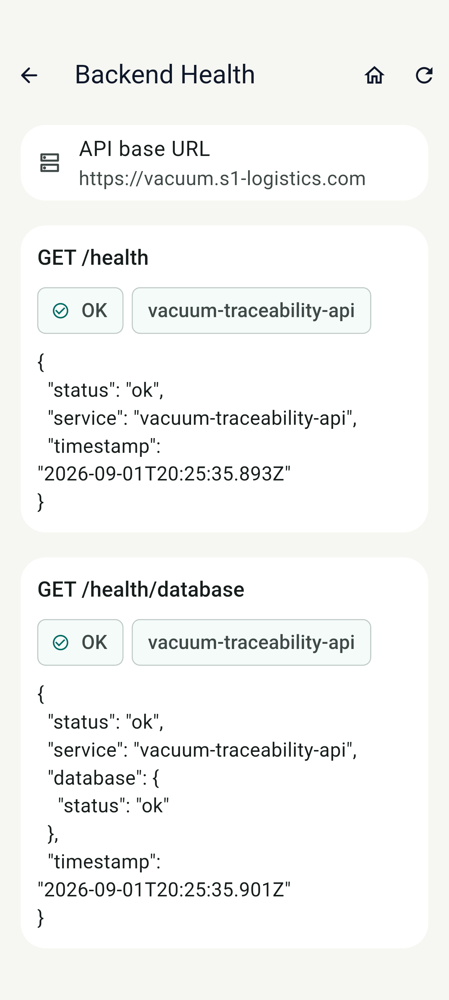

# Οδηγός χρήσης της εφαρμογής κινητού

Κάθε οθόνη της εφαρμογής Android, όπως τη βλέπει ο χειριστής στην αποθήκη: τι δείχνει, τι κάνει, και ποιοι έλεγχοι γίνονται από τον διακομιστή πίσω από κάθε ενέργεια.

> Για έκδοση PDF, ανοίξτε το `odigos-kinitou.html` και επιλέξτε Εκτύπωση → Αποθήκευση ως PDF.

## Περιεχόμενα

1. [Σύνδεση](#1-σύνδεση) — Η εφαρμογή ανοίγει στην οθόνη σύνδεσης. Χωρίς λογαριασμό δεν εκτελείται καμία ενέργεια.
2. [Αρχική οθόνη](#2-αρχική-οθόνη) — Το κέντρο της εφαρμογής: η τρέχουσα εικόνα και οι τέσσερις εργασίες.
3. [Σαρωτής QR](#3-σαρωτής-qr) — Ο σαρωτής που χρησιμοποιούν όλες οι εργασίες. Το πλαίσιο δείχνει πού να στοχεύσετε.
4. [Χρέωση — Βήμα 1](#4-χρέωση-βήμα-1) — Τοποθέτηση ενός Vacuum σε μηχάνημα. Ξεκινά με τη σάρωση του Vacuum.
5. [Χρέωση — Βήμα 2](#5-χρέωση-βήμα-2) — Επιλογή μηχανήματος από τη λίστα των διαθέσιμων.
6. [Χρέωση — Επιβεβαίωση](#6-χρέωση-επιβεβαίωση) — Πριν καταγραφεί οτιδήποτε, η εφαρμογή δείχνει ακριβώς τι πρόκειται να γίνει.
7. [Αποχρέωση](#7-αποχρέωση) — Επιστροφή ενός Vacuum από το μηχάνημα σε θέση ραφιού.
8. [Δήλωση Βλάβης](#8-δήλωση-βλάβης) — Όταν ένα Vacuum παρουσιάσει πρόβλημα: μεταφορά σε θέση επισκευής, με φωτογραφική τεκμηρίωση.
9. [Αποκατάσταση Βλάβης](#9-αποκατάσταση-βλάβης) — Το κλείσιμο της επισκευής: τι έγινε και πού πηγαίνει το Vacuum.
10. [Ρυθμίσεις](#10-ρυθμίσεις) — Διεύθυνση διακομιστή, ταυτότητα συσκευής και ειδοποιήσεις.
11. [Λογαριασμός και αποσύνδεση](#11-λογαριασμός-και-αποσύνδεση) — Στο κάτω μέρος των ρυθμίσεων: ποιος είναι συνδεδεμένος και πώς αποσυνδέεται.
12. [Έλεγχος Backend](#12-έλεγχος-backend) — Διαγνωστικό εργαλείο: απαντά ο διακομιστής και η βάση δεδομένων;

---

## 1. Σύνδεση

Η εφαρμογή ανοίγει στην οθόνη σύνδεσης. Χωρίς λογαριασμό δεν εκτελείται καμία ενέργεια.

Κάθε χειριστής έχει προσωπικό λογαριασμό. Δεν υπάρχει κοινός κωδικός για τη συσκευή: κάθε κίνηση καταγράφεται με το όνομα του ατόμου που την έκανε, και αυτό είναι η βάση της ιχνηλασιμότητας.
Η συνεδρία κρατά 12 ώρες και αποθηκεύεται στη συσκευή, οπότε δεν χρειάζεται σύνδεση σε κάθε χρήση μέσα στη βάρδια.

| Στοιχείο | Τι κάνει |
|---|---|
| **Όνομα χρήστη** | Πάντα με πεζά γράμματα. |
| **Κωδικός** | Το εικονίδιο ματιού εμφανίζει προσωρινά τι πληκτρολογήθηκε. |
| **Ρυθμίσεις διακομιστή** | Η διεύθυνση του διακομιστή. Ορίζεται μία φορά ανά συσκευή. |

> Αν εμφανιστεί «Δεν υπάρχει σύνδεση με τον διακομιστή», το πρόβλημα είναι δικτυακό ή η διεύθυνση είναι λάθος — δεν πρόκειται για λάθος κωδικό. Ελέγξτε το Wi-Fi και τη διεύθυνση από τις Ρυθμίσεις διακομιστή.

---

## 2. Αρχική οθόνη

Το κέντρο της εφαρμογής: η τρέχουσα εικόνα και οι τέσσερις εργασίες.

Στην κορυφή εμφανίζονται τα τρία σύνολα, ενημερωμένα από τον διακομιστή: πόσα Vacuum είναι πάνω σε μηχανήματα, πόσα βρίσκονται διαθέσιμα σε ράφι, και πόσα περιμένουν επισκευή.
Από κάτω, οι τέσσερις εργασίες που καλύπτουν όλο τον κύκλο ζωής ενός Vacuum. Κάθε μία ξεκινά με σάρωση του QR.

| Στοιχείο | Τι κάνει |
|---|---|
| **Εικονίδιο QR (πάνω αριστερά)** | Ελεύθερη σάρωση, για γρήγορο έλεγχο ενός Vacuum χωρίς να ξεκινήσει εργασία. |
| **Γρανάζι (πάνω δεξιά)** | Ρυθμίσεις, ειδοποιήσεις και αποσύνδεση. |
| **Χρέωση** | Τοποθέτηση Vacuum σε μηχάνημα. |
| **Αποχρέωση** | Επιστροφή από μηχάνημα σε θέση ραφιού. |
| **Δήλωση Βλάβης** | Έναρξη επισκευής, με φωτογραφίες. |
| **Αποκατάσταση Βλάβης** | Ολοκλήρωση επισκευής και επιστροφή σε ράφι. |
| **Έλεγχος Backend** | Επιβεβαίωση ότι ο διακομιστής απαντά. |

---

## 3. Σαρωτής QR

Ο σαρωτής που χρησιμοποιούν όλες οι εργασίες. Το πλαίσιο δείχνει πού να στοχεύσετε.

Η σάρωση γίνεται αυτόματα μόλις ο κωδικός μπει στο πλαίσιο — δεν χρειάζεται πάτημα κουμπιού. Αναγνωρίζονται κωδικοί Vacuum, μηχανημάτων και θέσεων· η εφαρμογή καταλαβαίνει μόνη της τι σαρώθηκε.
Κάτω από την κάμερα υπάρχει πεδίο πληκτρολόγησης. Χρησιμεύει όταν η ετικέτα έχει φθαρεί ή ο φωτισμός δεν επιτρέπει σάρωση: το αποτέλεσμα είναι **ακριβώς το ίδιο** με τη σάρωση, με τους ίδιους ελέγχους.

> Την πρώτη φορά το Android ζητά άδεια χρήσης κάμερας. Χωρίς αυτήν λειτουργεί μόνο η πληκτρολόγηση.

---

## 4. Χρέωση — Βήμα 1

Τοποθέτηση ενός Vacuum σε μηχάνημα. Ξεκινά με τη σάρωση του Vacuum.

Σαρώστε το QR του Vacuum ή πληκτρολογήστε τον σειριακό του. Η εφαρμογή ελέγχει αμέσως με τον διακομιστή αν το συγκεκριμένο Vacuum μπορεί να χρεωθεί: αν βρίσκεται ήδη σε άλλο μηχάνημα ή είναι σε επισκευή, η ενέργεια σταματά εδώ με σαφές μήνυμα.

| Στοιχείο | Τι κάνει |
|---|---|
| **Σκανάρισμα Vacuum** | Άνοιγμα κάμερας. |
| **Σειριακό / QR + ΟΚ** | Χειροκίνητη καταχώρηση, με τον ίδιο έλεγχο. |

---

## 5. Χρέωση — Βήμα 2

Επιλογή μηχανήματος από τη λίστα των διαθέσιμων.

Αφού αναγνωριστεί το Vacuum, εμφανίζονται τα μηχανήματα. Η λίστα έρχεται από τη βάση, οπότε δεν χρειάζεται να θυμάται κανείς κωδικούς. Τα ήδη κατειλημμένα μηχανήματα σημειώνονται, ώστε να μην επιλεγούν κατά λάθος.
Εναλλακτικά μπορείτε να σαρώσετε το QR του μηχανήματος.

---

## 6. Χρέωση — Επιβεβαίωση

Πριν καταγραφεί οτιδήποτε, η εφαρμογή δείχνει ακριβώς τι πρόκειται να γίνει.

Εμφανίζονται τα πλήρη στοιχεία και των δύο πλευρών: σειριακός, κωδικός και περιγραφή του Vacuum, κωδικός, όνομα και έργο του μηχανήματος. Έτσι εντοπίζεται αμέσως αν σαρώθηκε λάθος ετικέτα.
Η κίνηση καταγράφεται **μόνο** με το πάτημα του πράσινου κουμπιού. Το «Άκυρο» κλείνει την επιβεβαίωση χωρίς καμία αλλαγή.

| Στοιχείο | Τι κάνει |
|---|---|
| **Άκυρο** | Επιστροφή χωρίς καταγραφή. |
| **ΧΡΕΩΣΗ** | Οριστική καταγραφή. Το Vacuum περνά σε κατάσταση «ενεργό». |

> Το ίδιο μοτίβο δύο βημάτων και επιβεβαίωσης ακολουθούν και οι τέσσερις εργασίες. Καμία δεν καταγράφει κάτι χωρίς ρητή επιβεβαίωση.

---

## 7. Αποχρέωση

Επιστροφή ενός Vacuum από το μηχάνημα σε θέση ραφιού.

Σαρώνετε το Vacuum και έπειτα τη θέση ραφιού όπου το τοποθετείτε. Ο διακομιστής επιβεβαιώνει ότι η θέση είναι ελεύθερη — μία θέση δέχεται ένα Vacuum, ώστε η καταγραφή να αντιστοιχεί στην πραγματικότητα του ραφιού.
Με την ολοκλήρωση, το Vacuum περνά σε «μη ενεργό» και γίνεται διαθέσιμο για επόμενη χρέωση.

---

## 8. Δήλωση Βλάβης

Όταν ένα Vacuum παρουσιάσει πρόβλημα: μεταφορά σε θέση επισκευής, με φωτογραφική τεκμηρίωση.

Μετά τη σάρωση του Vacuum επιλέγετε το είδος της βλάβης από τον κατάλογο και τη θέση επισκευής όπου το αφήνετε. Αν το πρόβλημα δεν ταιριάζει σε καμία κατηγορία, υπάρχει επιλογή ελεύθερης περιγραφής.
**Απαιτούνται από μία έως πέντε φωτογραφίες.** Χωρίς αυτές ο διακομιστής δεν δέχεται τη δήλωση. Αποτελούν την τεκμηρίωση της κατάστασης τη στιγμή του εντοπισμού και εμφανίζονται αργότερα στο περιβάλλον διαχείρισης.

> Οι φωτογραφίες αποθηκεύονται σε ιδιωτικό χώρο στον διακομιστή της εταιρίας. Δεν αποστέλλονται σε καμία εξωτερική υπηρεσία και δεν παραμένουν στη συλλογή εικόνων του κινητού.

---

## 9. Αποκατάσταση Βλάβης

Το κλείσιμο της επισκευής: τι έγινε και πού πηγαίνει το Vacuum.

Σαρώνετε το Vacuum που βρίσκεται σε επισκευή. Η εφαρμογή φέρνει τα στοιχεία της ανοιχτής επισκευής και ζητά το αποτέλεσμα.
Απαιτούνται επίσης **μία έως πέντε φωτογραφίες ολοκλήρωσης**, ώστε να υπάρχει σύγκριση «πριν και μετά» για κάθε επισκευή.

| Στοιχείο | Τι κάνει |
|---|---|
| **Επιστροφή σε λειτουργία** | Επισκευάστηκε και επιστρέφει σε ράφι ως διαθέσιμο. |
| **Εκτός λειτουργίας** | Δεν επισκευάστηκε· παραμένει εκτός χρήσης. |
| **Απόσυρση** | Οριστική απόσυρση από τον στόλο. |
| **Παραμένει σε επισκευή** | Η εργασία συνεχίζεται· η επισκευή δεν κλείνει. |

---

## 10. Ρυθμίσεις

Διεύθυνση διακομιστή, ταυτότητα συσκευής και ειδοποιήσεις.

Η **διεύθυνση διακομιστή** ορίζεται μία φορά κατά τη διανομή της συσκευής. Το «Έλεγχος σύνδεσης» επιβεβαιώνει ότι ο διακομιστής απαντά — χρήσιμο πρώτο βήμα όταν κάτι δεν δουλεύει.
Το **αναγνωριστικό συσκευής** παράγεται αυτόματα και καταγράφεται σε κάθε κίνηση, ώστε να φαίνεται από ποια συσκευή έγινε η καταχώρηση.

| Στοιχείο | Τι κάνει |
|---|---|
| **Διεύθυνση διακομιστή** | Πού συνδέεται η εφαρμογή. Αποθήκευση με το «Save». |
| **Έλεγχος σύνδεσης** | Δοκιμή επικοινωνίας με τον διακομιστή. |
| **Αντιγραφή** | Αντιγραφή του αναγνωριστικού συσκευής, για υποστήριξη. |
| **Ειδοποιήσεις** | Δύο διακόπτες: ειδοποίηση όταν ένα Vacuum πάει σε επισκευή, και όταν ολοκληρώνεται αποκατάσταση. |

---

## 11. Λογαριασμός και αποσύνδεση

Στο κάτω μέρος των ρυθμίσεων: ποιος είναι συνδεδεμένος και πώς αποσυνδέεται.

Εμφανίζεται το ονοματεπώνυμο και το όνομα χρήστη του συνδεδεμένου ατόμου. Χρησιμεύει για γρήγορο έλεγχο πριν από μια καταχώρηση — ειδικά σε κοινόχρηστες συσκευές βάρδιας.
Η **Αποσύνδεση** ζητά επιβεβαίωση και επιστρέφει στην οθόνη σύνδεσης. Στο τέλος της βάρδιας σε κοινόχρηστη συσκευή, είναι το σωστό βήμα ώστε ο επόμενος χειριστής να συνδεθεί με τον δικό του λογαριασμό.

> Αν λήξει η συνεδρία ή ο λογαριασμός απενεργοποιηθεί από διαχειριστή, η εφαρμογή επιστρέφει μόνη της στην οθόνη σύνδεσης.

---

## 12. Έλεγχος Backend

Διαγνωστικό εργαλείο: απαντά ο διακομιστής και η βάση δεδομένων;

Το πρώτο βήμα όταν κάτι δεν λειτουργεί. Ξεχωρίζει τρεις καταστάσεις: ο διακομιστής δεν απαντά (δικτυακό πρόβλημα ή λάθος διεύθυνση), απαντά αλλά η βάση όχι (πρόβλημα στον διακομιστή), ή όλα λειτουργούν και το πρόβλημα είναι αλλού.
Το αποτέλεσμα βοηθά την υποστήριξη να εντοπίσει γρήγορα το σημείο της βλάβης.

---

Οι εικόνες προέρχονται από πραγματική συσκευή Android με δοκιμαστικά δεδομένα. Καμία ενέργεια δεν καταγράφεται χωρίς ρητή επιβεβαίωση από τον χειριστή.
